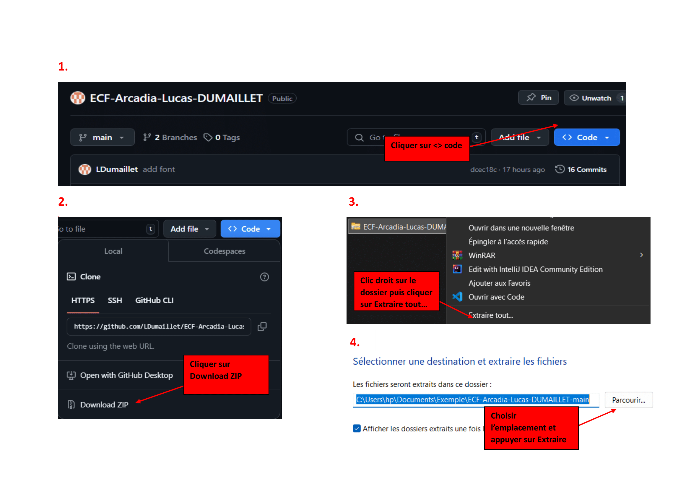

# Ce que le projet fait :

- Le projet a pour objectif de réaliser le site web d’un parc zoologique, nommé ARCADIA.

## Pourquoi le projet est utile :

- L’application doit servir les besoins de plusieurs destinataires du projet. D’une part, le
  directeur attend, de la création de ce projet, une diffusion claire et précise de ces valeurs lui permettant de se
  différencier de ses concurrents. Le but étant de proposer une application capable de véhiculer par son thème,
  sa fonctionnalité et sa précision, la publicité de ce parc zoologique. D’autre part, l’utilisateur doit être face à
  une application ergonomique, compréhensible tant sur le plan technique qu’éthique.

## Pour déployer l'application vous devez :

#### 1ère solution

```bash
npm install
```

```bash
- git clone https://github.com/LDumaillet/ECF-Arcadia-Lucas-DUMAILLET.git
```

#### 2ème solution


